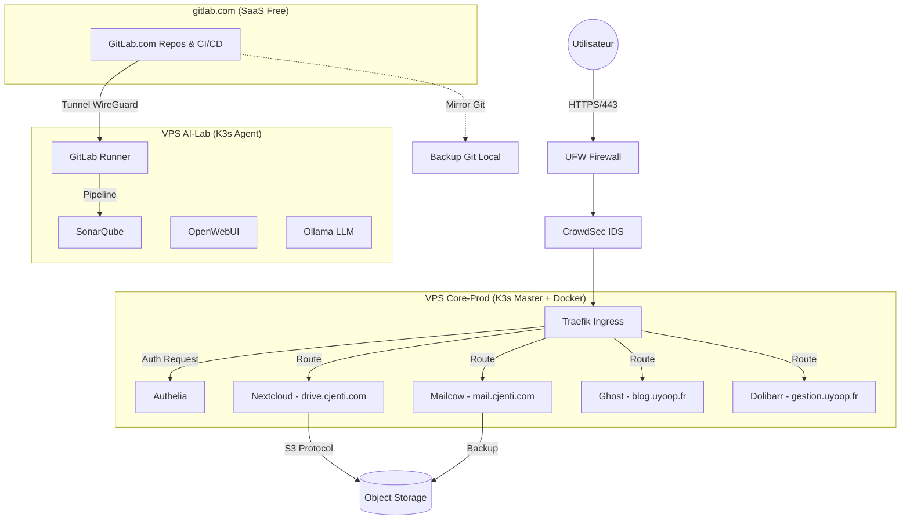

# Architecture Technique & Choix Stratégiques V2

> **Cible** : Infrastructure Souveraine, DevSecOps, support Titre RNCP (Juin 2026).
> **Statut** : V2 (6 Février 2026) — Intègre stratégie GitLab hybride, corrections specs OVH, harmonisation sécurité.

## 1. Vision Technique & Slogan
**uyoop : Une stratégie à votre image.**
### *Souveraineté. Sécurité. Intelligence Artificielle.*

En DevSecOps, "votre image" n'est pas seulement graphique, c'est votre empreinte numérique (Docker Images, System Images). Notre stratégie est de rendre cette image **souveraine, sécurisée et immuable**.
Nous passons d'une consommation passive de services (SaaS) à une **Infrastructure as Code (IaC)** où chaque configuration reflète exactement les besoins métier, sans compromis sur la sécurité.

---

## 2. Infrastructure Physique (Topologie Distribuée)
Pour garantir la sécurité (isolation) et la performance (IA), l'architecture repose sur deux nœuds interconnectés (Cluster Hybride).

### Node A : "CORE-PROD" (Opérationnel Février)
*   **Infrastructure** : OVH **VPS-3** (8 vCores / 24 Go RAM / 200 Go NVMe).
*   **Rôle** : Hébergement des services critiques "Business".
*   **Charge** : Stable, haute disponibilité requise.
*   **Services** : Mailcow (Mail), Nextcloud (Data), Ghost (Web), Authelia (Secu).

### Node B : "AI-LAB" (Extension Phase 2 - Avril)
*   **Infrastructure** : OVH **VPS-2** (6 vCores / 12 Go RAM / 100 Go NVMe).
*   **Rôle** : R&D, Intelligence Artificielle, Analyse de Code, GitLab Runner self-hosted.
*   **Charge** : Variable (Burstable), traitements lourds.
*   **Services** : GitLab Runner (connecté à gitlab.com), LLM Local (Ollama), SonarQube (Quality Gate), Open WebUI (Interface IA).

> **Stratégie Noms de Domaine** :
> *   `uyoop.fr` / `uyoop.com` — **Professionnel** : Vitrine, services métier, identité entreprise (`blog.uyoop.fr`, `git.uyoop.fr`).
> *   `cjenti.fr` / `cjenti.com` — **Personnel** : Mail, Drive, services perso (`mail.cjenti.com`, `drive.cjenti.com`).

> **Liaison** : Tunnel WireGuard privé (Mesh, MTU 1420, PersistentKeepalive=25) pour sécuriser les flux inter-nœuds sans exposition publique.
>
> **Stratégie GitLab** : Phase 1-2 sur **gitlab.com** (Free Tier) pour préserver la RAM du VPS-3. Runner self-hosted sur VPS-2. Migration vers GitLab CE self-hosted envisageable en Phase 3+ si la souveraineté totale du code l'exige. Mirror automatique gitlab.com → VPS comme plan de réversibilité.
>
> **Mirror GitHub** : Les repos publics sont mirrorés automatiquement de GitLab → **GitHub** pour la visibilité portfolio et la vitrine technique.

---

## 3. La "Golden Stack" Technologique

### A. Orchestration & Système (Infrastructure as Code)
Toute l'infrastructure est définie par le code (GitOps).
*   **OS** : Debian 12 (Bookworm) durci.
*   **Provisioning** : **Ansible** (Configuration Management) pour l'initialisation des nœuds et la sécurité.
*   **Orchestrateur** : **K3s** (Lightweight Kubernetes).
    *   *Architecture* : Multi-node capable (Server + Agent).
    *   *Stockage* : `local-path-provisioner` (inclus K3s) en Phase 1. Longhorn envisageable en multi-node.
*   **Ingress** : **Traefik** Cloud Native Router.
*   **Certificats** : **Cert-Manager** (ACME Let's Encrypt).
*   **Maintenance** : **Renovate Bot** (Mises à jour automatiques des dépendances).

### B. Matrice des Services Applicatifs
| Service | Rôle | Namespace K8s | Stockage |
| :--- | :--- | :--- | :--- |
| **Mailcow** | Serveur Mail Complet (Postfix/Dovecot) — **Docker Compose standalone** (seul mode officiellement supporté) | `prod-mail` (Docker) | NVMe |
| **Nextcloud** | Hub Collaboratif (Fichiers, Cal, Contacts) | `prod-cloud` | Mixte (Cache NVMe / Data S3) |
| **GitLab** | Forge Logicielle & CI/CD (SaaS gitlab.com Phase 1-2, self-hosted optionnel Phase 3+) | `devops-factory` | gitlab.com (SaaS) + S3 (Artifacts) |
| **Ghost** | CMS Vitrine & LMS | `prod-web` | NVMe |
| **Mautic** | Marketing Automation & Emailing (vs Brevo) | `prod-marketing` (ou Docker) | MariaDB + NVMe |
| **Dolibarr** | ERP & CRM (Facturation, Compta, Gestion) | `prod-gestion` | MariaDB + NVMe |
| **Authelia** | Fournisseur d'Identité (SSO, OIDC, 2FA) | `security` | Redis (Session) |

### C. Sécurité "Defense-In-Depth"
1.  **Périmètre Réseau** : **UFW** (Firewall hôte) + **CrowdSec** (détection d'intrusions collaborative, remplace Fail2Ban) pour une défense basée sur la réputation IP communautaire.
2.  **Identité Zero-Trust** : Portail unique (SSO Authelia) pour toutes les WebUIs. Pas d'accès direct sauf exception documentée.
3.  **Application** : Scans de vulnérabilités (Trivy) et analyse statique (SonarQube) intégrés aux pipelines CI/CD.
4.  **Réseau** : `NetworkPolicies` Kubernetes interdisant le trafic `dev` -> `prod`.
5.  **Secrets** : Double approche complémentaire :
    *   **Sealed Secrets** (Bitnami) : Chiffrement asymétrique des secrets dans Git (GitOps-safe). **Déployé Phase 2** (Avril).
    *   **HashiCorp Vault** : Gestion dynamique des secrets runtime (rotation, leases, injection sidecar). **Déployé Phase 3** (Mai).
    *   *Flux* : Sealed Secrets pour le stockage Git → Vault pour l'injection runtime dans les Pods.

---

## 4. Stratégie de Données (Stockage Hybride & Immuable)

Pour optimiser les coûts et la performance des disques NVMe limités :

*   **Tier 1 (Performance)** : Base de données, Code source, Emails récents (< 90 jours).
    *   *Support* : NVMe Local (VPS).
*   **Tier 2 (Capacité)** : Drive personnel, Archives mails, Artifacts CI/CD.
    *   *Support* : **Object Storage S3** (Scalable à l'infini).
*   **Stratégie Backup** : Règle du **3-2-1** renforcée.
    *   Snapshots locaux (local-path-provisioner/LVM) + sauvegarde auto VPS incluse (1 jour, gamme OVH 2026).
    *   Backup S3 chiffré (Restic/Velero) avec **Object Lock** (Immuabilité Ransomware).
    *   Copie froide (Disque dur local Admin).
    *   **Test DRP** : Exercice biannuel de restauration complète.

### Gouvernance Dual : K3s + Docker Compose
Mailcow fonctionne en Docker Compose standalone (seul mode supporté), tandis que les autres services tournent sous K3s. Cela crée **deux plans de gestion** unifiés par :
*   **Backup** : Script `restic` unique qui sauvegarde `/opt/mailcow/` (Docker) **et** les PV K3s dans le même job cron vers S3.
*   **Monitoring** : `node-exporter` + `cAdvisor` couvrent les deux runtimes. Grafana agrège les métriques Docker et K3s dans un dashboard unifié.
*   **Cycle de vie** : `Renovate Bot` surveille les images Docker (Mailcow) et les charts Helm (K3s) via le même dépôt Git.
*   **Logs** : Centralisation via `journalctl` (système) + `kubectl logs` (K3s) + `docker compose logs` (Mailcow). Agrégation optionnelle Loki/Promtail.

---

## 5. Flux Réseaux Critiques

### Schéma Réseau IP & Ports

| Composant | Interface | Adresse / Plage | Ports Exposés | Note |
| :--- | :--- | :--- | :--- | :--- |
| **VPS-3** (Core-Prod) | `eth0` (public) | IP publique OVH | 22 (SSH), 80, 443, 25, 587, 993 (SMTP/IMAP) | UFW + CrowdSec |
| **VPS-3** (Core-Prod) | `wg0` (WireGuard) | `10.8.0.1/24` | 51820/UDP | Tunnel mesh |
| **VPS-2** (AI-Lab) | `eth0` (public) | IP publique OVH | 22 (SSH) | Pas de services Web directs |
| **VPS-2** (AI-Lab) | `wg0` (WireGuard) | `10.8.0.2/24` | 51820/UDP | Tunnel mesh |
| **K3s** (Cluster Network) | `cni0` | `10.42.0.0/16` (Pods) | Interne | Flannel VXLAN (défaut K3s) |
| **K3s** (Service Network) | `ClusterIP` | `10.43.0.0/16` (Services) | Interne | DNS interne CoreDNS |
| **Traefik** | `LoadBalancer` | Bind 80/443 sur `eth0` | 80 (redirect), 443 (TLS) | Entry point unique |
| **Mailcow** | `docker0` | `172.22.1.0/24` (Docker network) | 25, 587, 993, 443 (SOGo) | Docker Compose standalone |

**Règles UFW** :
```bash
ufw default deny incoming
ufw default allow outgoing
ufw allow 22/tcp    # SSH
ufw allow 80/tcp    # HTTP (redirect)
ufw allow 443/tcp   # HTTPS (Traefik)
ufw allow 25/tcp    # SMTP
ufw allow 587/tcp   # SMTP Submission
ufw allow 993/tcp   # IMAPS
ufw allow 51820/udp # WireGuard
```


