# 05. AIOPS : INTELLIGENCE ARTIFICIELLE OPÉRATIONNELLE

> **Statut** : V2.0 (7 Février 2026) - Remplacement Perplexica par Open WebUI.
> **Vision** : Transformer l'infrastructure en plateforme intelligente.

## 1. Architecture IA Souveraine
L'IA ne doit pas être une boîte noire externe. Elle tourne "On-Premise" sur le **VPS-2 (AI-Lab)**.

| Composant | Solution Retenue | Rôle |
| :--- | :--- | :--- |
| **Moteur LLM** | **Ollama** | Exécution des modèles (Mistral, Llama 3, Gemma). Optimisé CPU. |
| **Interface** | **Open WebUI** | Clone ChatGPT, gestion des utilisateurs, historique. |
| **Mémoire (RAG)** | **ChromaDB** (Intégré) | Base vectorielle pour indexer la documentation. |

## 2. Cas d'Usage "Day-to-Day"

### A. RAG (Retrieval Augmented Generation) : "Discute avec ton Infra"
*   **Source** : Le dépôt Git `infrastructure` et le dossier `docs/` sont indexés.
*   **Usage** :
    *   *"Comment je redéploie le service Dolibarr ?"*
    *   *"Quelles sont les IPs bannies hier ?"*
*   **Avantage** : Réponse contextuelle basée sur **NOS** procédures, pas sur une doc générique d'internet.

### B. Assistant de Coding (Copilot Local)
*   **Outil** : `ollama` connecté à VS Code via plugin (ex: `Continue`).
*   **Modèle** : `codellama` ou `starcoder`.
*   **Gain** : Autocomplétion intelligente sans envoyer de code propriétaire chez GitHub/Microsoft.

## 3. Agents Autonomes (Roadmap)

### Agent 1 : "Log Sentinel"
*   **Mission** : Analyser les logs non structurés que Regex/CrowdSec ratent.
*   **Technique** : Script Python qui envoie des batchs de logs d'erreur à Ollama.
*   **Prompt** : *"Analyse ces logs d'erreur Nginx. Trouve la cause racine probable. Est-ce une attaque ou une config ratée ?"*

### Agent 2 : "Code Reviewer"
*   **Mission** : Valider les Merge Requests GitLab.
*   **Technique** : Pipeline CI qui déclenche un scan LLM sur le diff.
*   **Sortie** : Commentaire automatique dans la MR : *"Attention, tu as hardcodé un mot de passe ligne 42."*

## 4. Synergie IA ↔ uHub (Le Chaînon Manquant)

L'IA et uHub ne sont pas des îlots séparés. Ils forment un **système nerveux unifié**.

### A. uHub → IA (Données d'Entraînement RAG)
| Source uHub | Indexation | Usage IA |
| :--- | :--- | :--- |
| **Jobs** (historique) | Export JSON → ChromaDB | *"Quels jobs ont échoué ce mois ?"* |
| **Incidents** (timeline) | Export JSON → ChromaDB | *"Résume l'incident du 15/03"* |
| **PostMortems** | Export Markdown → ChromaDB | *"Quelles sont les causes récurrentes de crash ?"* |
| **AuditLogs** | Export JSON → ChromaDB | *"Qui a modifié le secret X hier ?"* |

**Implémentation** : Endpoint uHub `GET /api/export/rag` (JSON) → Script Cron → Ingestion ChromaDB.

### B. IA → uHub (Actions Automatisées)
| Agent | Événement Détecté | Action uHub |
| :--- | :--- | :--- |
| **Log Sentinel** | Pattern suspect dans les logs | `POST /api/incidents` (Création auto) |
| **Code Reviewer** | Faille de sécurité dans MR | `POST /api/jobs` (Job de review bloquant) |
| **FinOps Advisor** | Dépassement budget ressources | Notification dans uHub (Webhook interne) |

### C. Assistant Intégré (Roadmap v2)
*   **Vision** : Un widget "Chat IA" directement dans l'interface uHub.
*   **Technique** : Composant Vue.js → API Ollama (`POST /api/generate`).
*   **Usage** : L'Ops tape *"Pourquoi le job 42 a échoué ?"*, l'IA répond avec le contexte du Run + logs.

```mermaid
graph LR
    subgraph "uHub (Portail)"
        Jobs[Jobs/Runs]
        Incidents[Incidents]
        ChatWidget[💬 Widget IA]
    end
    
    subgraph "IA Stack (VPS-2)"
        Ollama[Ollama LLM]
        ChromaDB[ChromaDB]
    end
    
    Jobs -->|Export| ChromaDB
    Incidents -->|Export| ChromaDB
    ChatWidget -->|Query| Ollama
    Ollama -->|RAG| ChromaDB
    Ollama -->|Insight| ChatWidget
```

---
*L'IA n'est pas magique, c'est un stagiaire infatigable qui a lu toute la doc... et qui maintenant peut agir.*
