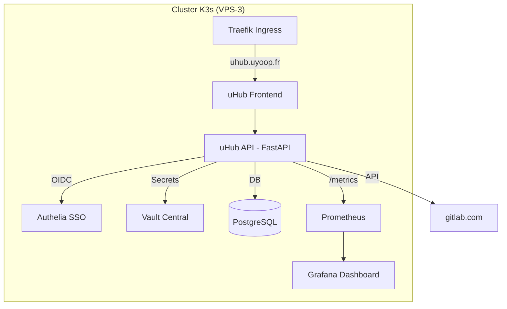

# 08. INTÉGRATION uHub : Stratégie "Plug-In"

> **Statut** : V1.0 (8 Février 2026)
> **Objectif** : Intégrer uHub comme module du socle VPS-3 en éliminant les redondances.

## 1. Contexte
**uHub** est un portail DevSecAiOps conçu pour centraliser la gestion des projets, jobs, incidents et intégrations (Git, Ansible, K8s).
Initialement pensée en standalone, l'application doit être **refactorisée** pour s'intégrer aux services partagés de l'infrastructure uyoopVPS.

## 2. Analyse des Redondances

| Module | uHub (Standalone) | Infra VPS-3 | Décision |
| :--- | :--- | :--- | :--- |
| **Auth** | OAuth2 Password + JWT | **Authelia** | 🔴 **Supprimer** → OIDC via Authelia |
| **Secrets** | Vault local | **Vault Central** | 🔴 **Supprimer** → Utiliser Vault partagé |
| **Reverse Proxy** | Nginx interne | **Traefik** | 🔴 **Supprimer** → Ingress K3s |
| **Monitoring** | Vue Serveur interne | **Prometheus/Grafana** | 🔴 **Supprimer** → Endpoint `/metrics` |
| **Database** | PostgreSQL | MariaDB (autres apps) | 🟢 **Conserver** → PostgreSQL (optimal pour FastAPI) |
| **Git** | API générique | **GitLab SaaS** | 🟢 **Adapter** → Pointer vers gitlab.com |

## 3. Architecture Cible



## 4. Modifications Requises dans uHub

### 4.1 Authentification (Priorité 1)
**Fichiers impactés** : `routers/auth.py`, `security.py`, `deps.py`

| Avant | Après |
| :--- | :--- |
| `POST /auth/token` (Password Flow) | **Supprimé** |
| JWT signé localement | JWT validé via Authelia (JWKS) |
| `get_current_user()` = decode JWT local | `get_current_user()` = decode token OIDC + mapping rôle |

**Mapping Rôles** :
```python
AUTHELIA_TO_UHUB_ROLE = {
    "admins": "admin",
    "projets": "projets", 
    "developers": "dev",
    "operators": "ops"
}
```

### 4.2 Secrets (Priorité 2)
**Fichiers impactés** : `services/secrets_service.py`, `config.py`

| Avant | Après |
| :--- | :--- |
| URL Vault = `http://localhost:8200` | URL Vault = `http://vault.security.svc:8200` |
| Token Vault = Variable d'env | Token Vault = Kubernetes ServiceAccount (Auth K8s) |

### 4.3 Reverse Proxy (Priorité 3)
**Fichiers impactés** : `infra/docker/nginx.Dockerfile`, `docker-compose.yml`

| Avant | Après |
| :--- | :--- |
| Nginx en sidecar | **Supprimé** |
| Port 8080 exposé via Nginx | Port 8080 exposé directement, Traefik route |

**Ingress K3s** :
```yaml
apiVersion: networking.k8s.io/v1
kind: Ingress
metadata:
  name: uhub-ingress
  annotations:
    traefik.ingress.kubernetes.io/router.middlewares: security-authelia@kubernetescrd
spec:
  rules:
  - host: uhub.uyoop.fr
    http:
      paths:
      - path: /api
        backend:
          service:
            name: uhub-backend
            port:
              number: 8000
      - path: /
        backend:
          service:
            name: uhub-frontend
            port:
              number: 8080
```

### 4.4 Monitoring (Priorité 4)
**Fichiers impactés** : `main.py` (ou nouveau `routers/metrics.py`)

**Ajout** : Endpoint `/metrics` format Prometheus.
```python
from prometheus_fastapi_instrumentator import Instrumentator

Instrumentator().instrument(app).expose(app, endpoint="/metrics")
```

## 5. Déploiement

### Phase 1 : Namespace & Base
```bash
kubectl create namespace prod-uhub
# Déployer PostgreSQL (Helm chart bitnami/postgresql)
# Configurer Secret pour DB credentials
```

### Phase 2 : Application
```bash
# Build images (GitLab CI)
# Deploy backend + frontend (Deployments K8s)
# Configurer Ingress + Middleware Authelia
```

### Phase 3 : Intégrations
```bash
# Configurer accès Vault (Policy + Auth K8s)
# Ajouter ServiceMonitor pour Prometheus
```

## 6. Vérification

| Test | Commande / Action | Résultat Attendu |
| :--- | :--- | :--- |
| **Login OIDC** | Accéder à uhub.uyoop.fr | Redirection vers Authelia, puis retour authentifié |
| **Secrets Vault** | Créer un GitRepo avec token | Token stocké dans Vault, non visible dans uHub |
| **Métriques** | `curl uhub.uyoop.fr/metrics` | Sortie format Prometheus |
| **Grafana** | Dashboard uHub | Graphiques requêtes/erreurs visibles |

## 7. Synergie avec la Stack IA (VPS-2)

uHub n'est pas isolé de l'IA. Les deux systèmes communiquent :

| Flux | Direction | Description |
| :--- | :--- | :--- |
| **RAG** | uHub → IA | uHub exporte Jobs/Incidents/PostMortems vers ChromaDB pour enrichir le contexte LLM. |
| **Agent Actions** | IA → uHub | Les agents (Log Sentinel, etc.) créent des Incidents dans uHub via API. |
| **Assistant Intégré** | Bidirectionnel | Widget Chat dans uHub, connecté à Ollama (VPS-2). |

> *Détails complets dans `05-AIOPS.md`, section "Synergie IA ↔ uHub".*

---
*uHub passe de "Application Autonome" à "Module Intégré" du socle DevSecAiOps uyoop.*
