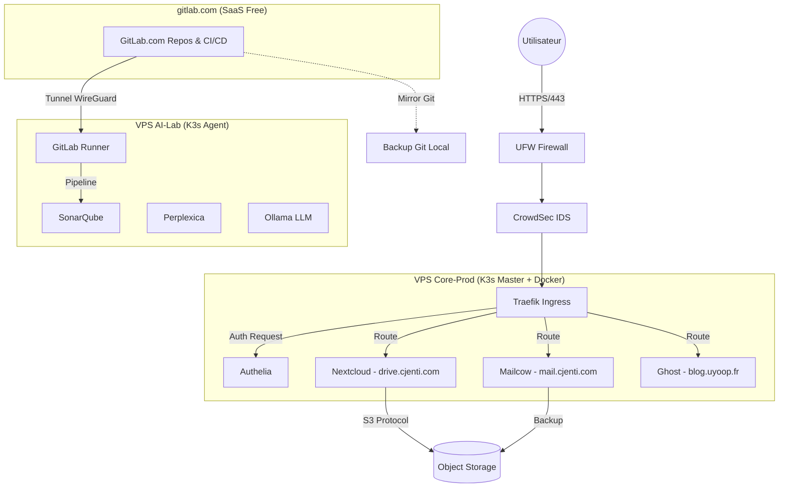

# DOSSIER PROJET : INFRASTRUCTURE SOUVERAINE UYOOP

## "Une stratégie à votre image."
### *Architecture DevSecOps à l'image de vos exigences.*

---

**PROJET DE TITRE RNCP 36061 (Niveau 6)**  
*Administrateur Systèmes DevOps*

**Auteur** : Christopher JENKINS  
**Date** : Février 2026  
**Version** : 5.0 (V2 — Audit complet, PRA/PCA, FinOps worst-case, Phase 4+ post-certif, schéma réseau)  

# SOMMAIRE EXÉCUTIF

Ce dossier présente la refonte complète de l'infrastructure numérique **uyoop**.  
Du statut de consommateur de services SaaS dispersés, nous passons à celui d'architecte d'une plateforme souveraine, sécurisée et pilotée par le code (**Infrastructure as Code**).

Ce projet, mené en parallèle des missions de stage, sert de terrain d'application réel aux compétences visées par le titre **Administrateur Systèmes DevOps** :
1.  **Concevoir** une architecture sécurisée (Zero-Trust).
2.  **Mettre en œuvre** une chaîne CI/CD complète (GitLab).
3.  **Superviser et Maintenir** en condition opérationnelle.
4.  **Intégrer** les nouveaux paradigmes (IA & FinOps).

---

## PLAN DU DOSSIER

*   **01. ARCHITECTURE** : Choix des technologies (K3s, Traefik, Ansible), Topologie, Sécurité Collaborative.
*   **02. PLANNING** : Roadmap de migration, stratégie de continuité (Plan B), perspectives post-certification.
*   **03. FINOPS** : Analyse des coûts, ROI et Budget Sérénité.
*   **04. PERSPECTIVES I.A.** : L'innovation au service de l'exploitation.
*   **05. RÉFÉRENTIEL DE COMPÉTENCES** : Tableau de correspondance avec le titre RNCP 36061.
*   **06. PRA/PCA** : Plan de Reprise & Continuité d'Activité (RPO/RTO, scénarios, procédures).

<!-- Inclusion du contenu 00 -->
# 00. CADRE & INSTRUCTIONS

## 1. Contexte du Projet
La migration **uyoopVPS** n'est pas une simple opération technique. C'est un projet structurant réalisé durant la période de stage (Fév-Mai 2026). Il démontre la capacité du candidat à gérer un projet d'infrastructure complet ("Side Project" professionnel) tout en assurant ses missions quotidiennes en entreprise.

## 2. Environnement Technique
*   **Poste de Travail** : Debian 13 (Labo Perso) & Environnement Enterprise.
*   **Cloud Provider** : OVHcloud (France).
*   **Philosophie** : "Zero-Trust", "Infrastructure as Code", "Souveraineté des Données".

<!-- Inclusion du contenu 01 -->
# 01. ARCHITECTURE TECHNIQUE

> **Cible** : Infrastructure Souveraine, DevSecOps, support Titre RNCP (Juin 2026).
> **Statut** : V2 (6 Février 2026) — Intègre stratégie GitLab hybride, corrections specs OVH, harmonisation sécurité.

## 1. Vision Technique & Slogan
**uyoop : "Une stratégie à votre image"**

En DevSecOps, "votre image" n'est pas seulement graphique, c'est votre empreinte numérique (Docker Images, System Images). Notre stratégie est de rendre cette image **souveraine, sécurisée et immuable**.
Nous passons d'une consommation passive de services (SaaS) à une **Infrastructure as Code (IaC)** où chaque configuration reflète exactement les besoins métier, sans compromis sur la sécurité.

---

## 2. Infrastructure Physique (Topologie Distribuée)
Pour garantir la sécurité (isolation) et la performance (IA), l'architecture repose sur deux nœuds interconnectés (Cluster Hybride).

### Node A : "CORE-PROD" (Opérationnel Février)
*   **Infrastructure** : OVH **VPS-3** (8 vCores / 24 Go RAM / 200 Go NVMe).
*   **Rôle** : Hébergement des services critiques "Business".
*   **Charge** : Stable, haute disponibilité requise.
*   **Services** : Mailcow (Mail), Nextcloud (Data), Ghost (Web), Authelia (Secu).

### Node B : "AI-LAB" (Extension Phase 2 - Avril)
*   **Infrastructure** : OVH **VPS-2** (6 vCores / 12 Go RAM / 100 Go NVMe).
*   **Rôle** : R&D, Intelligence Artificielle, Analyse de Code, GitLab Runner self-hosted.
*   **Charge** : Variable (Burstable), traitements lourds.
*   **Services** : GitLab Runner (connecté à gitlab.com), LLM Local ou Gateway API, SonarQube (Quality Gate), Perplexica (Search).

> **Stratégie Noms de Domaine** :
> *   `uyoop.fr` / `uyoop.com` — **Professionnel** : Vitrine, services métier, identité entreprise (`blog.uyoop.fr`, `git.uyoop.fr`).
> *   `cjenti.fr` / `cjenti.com` — **Personnel** : Mail, Drive, services perso (`mail.cjenti.com`, `drive.cjenti.com`).
>
> **Liaison** : Tunnel WireGuard privé (Mesh, MTU 1420, PersistentKeepalive=25) pour sécuriser les flux inter-nœuds sans exposition publique.
>
> **Stratégie GitLab** : Phase 1-2 sur **gitlab.com** (Free Tier) pour préserver la RAM du VPS-3. Runner self-hosted sur VPS-2. Migration vers GitLab CE self-hosted envisageable en Phase 3+ si la souveraineté totale du code l'exige. Mirror automatique gitlab.com → VPS comme plan de réversibilité.
>
> **Mirror GitHub** : Les repos publics sont mirrorés automatiquement de GitLab → **GitHub** pour la visibilité portfolio et la vitrine technique.

---

## 3. La "Golden Stack" Technologique

### A. Orchestration & Système (Infrastructure as Code)
Toute l'infrastructure est définie par le code (GitOps).
*   **OS** : Debian 12 (Bookworm) durci.
*   **Provisioning** : **Ansible** (Configuration Management) pour l'initialisation des nœuds et la sécurité.
*   **Orchestrateur** : **K3s** (Lightweight Kubernetes).
    *   *Architecture* : Multi-node capable (Server + Agent).
    *   *Stockage* : `local-path-provisioner` (inclus K3s) en Phase 1. Longhorn envisageable en multi-node.
*   **Ingress** : **Traefik** Cloud Native Router.
*   **Certificats** : **Cert-Manager** (ACME Let's Encrypt).
*   **Maintenance** : **Renovate Bot** (Mises à jour automatiques des dépendances).

### B. Matrice des Services Applicatifs
| Service | Rôle | Namespace K8s | Stockage |
| :--- | :--- | :--- | :--- |
| **Mailcow** | Serveur Mail Complet (Postfix/Dovecot) — **Docker Compose standalone** (seul mode officiellement supporté) | `prod-mail` (Docker) | NVMe |
| **Nextcloud** | Hub Collaboratif (Fichiers, Cal, Contacts) | `prod-cloud` | Mixte (Cache NVMe / Data S3) |
| **GitLab** | Forge Logicielle & CI/CD (SaaS gitlab.com Phase 1-2, self-hosted optionnel Phase 3+) | `devops-factory` | gitlab.com (SaaS) + S3 (Artifacts) |
| **Ghost** | CMS Vitrine & LMS | `prod-web` | NVMe |
| **Authelia** | Fournisseur d'Identité (SSO, OIDC, 2FA) | `security` | Redis (Session) |

### C. Sécurité "Defense-In-Depth"
1.  **Périmètre Réseau** : **UFW** (Firewall hôte) + **CrowdSec** (détection d'intrusions collaborative, remplace Fail2Ban) pour une défense basée sur la réputation IP communautaire.
2.  **Identité Zero-Trust** : Portail unique (SSO Authelia) pour toutes les WebUIs. Pas d'accès direct sauf exception documentée.
3.  **Application** : Scans de vulnérabilités (Trivy) et analyse statique (SonarQube) intégrés aux pipelines CI/CD.
4.  **Réseau** : `NetworkPolicies` Kubernetes interdisant le trafic `dev` -> `prod`.
5.  **Secrets** : Double approche complémentaire :
    *   **Sealed Secrets** (Bitnami) : Chiffrement asymétrique des secrets dans Git (GitOps-safe). **Déployé Phase 2** (Avril).
    *   **HashiCorp Vault** : Gestion dynamique des secrets runtime (rotation, leases, injection sidecar). **Déployé Phase 3** (Mai).
    *   *Flux* : Sealed Secrets pour le stockage Git → Vault pour l'injection runtime dans les Pods.

---

## 4. Stratégie de Données (Stockage Hybride & Immuable)

Pour optimiser les coûts et la performance des disques NVMe limités :

*   **Tier 1 (Performance)** : Base de données, Code source, Emails récents (< 90 jours).
    *   *Support* : NVMe Local (VPS).
*   **Tier 2 (Capacité)** : Drive personnel, Archives mails, Artifacts CI/CD.
    *   *Support* : **Object Storage S3** (Scalable à l'infini).
*   **Stratégie Backup** : Règle du **3-2-1** renforcée.
    *   Snapshots locaux (local-path-provisioner/LVM) + sauvegarde auto VPS incluse (1 jour, gamme OVH 2026).
    *   Backup S3 chiffré (Restic/Velero) avec **Object Lock** (Immuabilité Ransomware).
    *   Copie froide (Disque dur local Admin).
    *   **Test DRP** : Exercice biannuel de restauration complète.

### Gouvernance Dual : K3s + Docker Compose
Mailcow fonctionne en Docker Compose standalone, les autres services sous K3s. Unification par :
*   **Backup** : Script `restic` unique couvrant `/opt/mailcow/` (Docker) et les PV K3s dans le même job cron.
*   **Monitoring** : `node-exporter` + `cAdvisor` couvrent les deux runtimes. Dashboard Grafana unifié.
*   **Cycle de vie** : `Renovate Bot` surveille images Docker (Mailcow) et charts Helm (K3s) via le même dépôt Git.

---

## 5. Flux Réseaux Critiques

### Schéma Réseau IP & Ports

| Composant | Interface | Adresse / Plage | Ports Exposés | Note |
| :--- | :--- | :--- | :--- | :--- |
| **VPS-3** (Core-Prod) | `eth0` (public) | IP publique OVH | 22 (SSH), 80, 443, 25, 587, 993 (SMTP/IMAP) | UFW + CrowdSec |
| **VPS-3** (Core-Prod) | `wg0` (WireGuard) | `10.8.0.1/24` | 51820/UDP | Tunnel mesh |
| **VPS-2** (AI-Lab) | `eth0` (public) | IP publique OVH | 22 (SSH) | Pas de services Web directs |
| **VPS-2** (AI-Lab) | `wg0` (WireGuard) | `10.8.0.2/24` | 51820/UDP | Tunnel mesh |
| **K3s** (Cluster Network) | `cni0` | `10.42.0.0/16` (Pods) | Interne | Flannel VXLAN (défaut K3s) |
| **K3s** (Service Network) | `ClusterIP` | `10.43.0.0/16` (Services) | Interne | DNS interne CoreDNS |
| **Traefik** | `LoadBalancer` | Bind 80/443 sur `eth0` | 80 (redirect), 443 (TLS) | Entry point unique |
| **Mailcow** | `docker0` | `172.22.1.0/24` (Docker network) | 25, 587, 993, 443 (SOGo) | Docker Compose standalone |

### Flux Mermaid

<!-- Inclusion du contenu 02 -->
# 02. PLANNING DE MIGRATION

> **Statut** : V2 (6 Février 2026) — Intègre stratégie GitLab hybride, Mailcow Docker Compose, corrections
> **Stratégie** : "Continuité d'abord, Code ensuite".
> **Contexte de Travail** : Projet mené en parallèle du stage. Charge de travail adaptée.

---

## 🔥 PHASE 1 : "OPÉRATION SOCLE" (Immédiat - 22 Février)
**Objectif Critique** : Continuité de service Mail/Data avant expiration contrats.
**Plan B (Secours)** : Si retard technique au 20/02, activation d'un mois de **Proton Unlimited** (12.99€) pour sécuriser les données sans pression.

### Semaine 06 (Infrastructure as Code Init)
*   [ ] **Repo** : Création du dépôt principal sur **gitlab.com** (Free Tier). Structure : `ansible/`, `k8s-manifests/`, `docker/`, `docs/`.
*   [ ] **Souscription** : Commande VPS Core-Prod (OVH) et domaines.
*   [ ] **Provisioning** : Création des rôles **Ansible** de base (`common`, `security`, `docker`, `k3s`).
    *   *Sécurité* : Installation auto de **UFW** + **CrowdSec** + SSH Hardening.

### Semaine 07 (Services Vitaux)
*   [ ] **Cluster** : Déploiement K3s via Ansible (Rôle `k3s-ansible`).
*   [ ] **Mail** : Déploiement Mailcow (**Docker Compose standalone** — seul mode supporté officiellement).
    *   *Test* : Validation Score SpamCheck (SPF/DKIM/DMARC).
*   [ ] **Data** : Déploiement Nextcloud (K3s).
    *   *Migration* : Upload manuel des 24 Go critiques.
*   [ ] **Mirror Git** : Cron `git clone --mirror` de gitlab.com vers VPS-3 (réversibilité souveraine).
*   [ ] **Bascule** : Changement DNS MX `cjenti.com` (mail perso) (Target : 21/02).

---

## 🛠️ PHASE 2 : "L'USINE LOGICIELLE" (Mars - Avril)
**Objectif Titre** : Industrialisation et Sécurité (DevSecOps).

### Mars : Identité & Web
*   [ ] **Migration Web** : Transfert domaines O2Switch -> OVH (`uyoop.fr`/`.com` pro + `cjenti.fr`/`.com` perso).
*   [ ] **SSO** : Déploiement **Authelia** (LDAP Mailcow backend).
*   [ ] **CMS** : Ghost Blog paramétré avec accès SSO.
*   [ ] **Maintenance** : Activation de **Renovate Bot** pour suivi des mises à jour.

### Avril : IA & Qualité (Extension "AI-Lab")
*   [ ] **Infra** : Provisioning VPS-2 (6 vCores / 12 Go RAM / 100 Go NVMe) via Ansible Playbook réutilisé.
*   [ ] **Réseau** : Configuration Tunnel WireGuard Mesh entre les nœuds (MTU 1420, PersistentKeepalive=25).
*   [ ] **CI/CD** : **GitLab Runner** self-hosted installé sur VPS-2, enregistré sur gitlab.com.
*   [ ] **Qualité** : SonarQube avec Quality Gate stricte, intégré au pipeline gitlab.com.
*   [ ] **Monitoring** : Déploiement **Prometheus** + **Grafana** + **AlertManager** (namespace `monitoring`). Alertes Discord/Mail sur CPU, RAM, disque, certificats.
*   [ ] **Secrets** : Déploiement **Sealed Secrets** (Bitnami) pour chiffrer les secrets dans Git.

---

## 🚀 PHASE 3 : "CONSOLIDATION & RÉSILIENCE" (Mai - Juin)
**Objectif Certification** : Preuves de robustesse et Documentation finale.

### Mai : Big Data & FinOps
*   [ ] **Storage** : Activation S3 Object Storage et règles de cycle de vie.
*   [ ] **Archivage** : Migration OneDrive -> S3 (Rclone).
*   [ ] **Observabilité** : Dashboard Grafana "FinOps" (Coûts OVH API) + dashboards services (Mailcow, Nextcloud, K3s).
*   [ ] **Vault** : Déploiement **HashiCorp Vault** (secrets dynamiques runtime, rotation, injection sidecar). Complète Sealed Secrets.

### Juin : Soutenance & DRP
*   [ ] **Crash Test (DRP)** : "Journée du Chaos".
    *   *Scénario* : Suppression volontaire du namespace `prod` et restauration depuis Backup S3.
    *   *Preuve* : Vidéo du rétablissement pour la soutenance.
*   [ ] **Livrable** : Repo Git nettoyé et public (ou accès Jury).

---

## 🌐 PHASE 4 : "LANCEMENT & PERSPECTIVES" (Juillet - Septembre)
**Objectif** : Mise en ligne publique de la solution uyoop et démarrage de l'activité professionnelle.

### Fin Juin : Pause
*   [ ] **Repos** : Quelques jours de décompression post-certification.

### Juillet-Août : Finalisation Plateforme
*   [ ] **Hardening** : Finalisation complète de l'infrastructure (sécurité, performance, contenus).
*   [ ] **Produit** : Mise en ligne de l'offre publique : **vitrine consulting DevSecOps + produit technique**.
*   [ ] **Contenu** : Rédaction d'articles blog Ghost (retours d'expérience, études de cas, veille sécurité).
*   [ ] **Portfolio** : Repos publics GitHub (mirror GitLab → GitHub) comme vitrine technique.

### Septembre : Phase d'Action Intensive
Deux branches parallèles :
*   **Branche A — CDI** : Ciblage d'entreprises françaises dans les secteurs **sécurité, souveraineté/défense, intelligence artificielle**. La plateforme uyoop sert de portfolio vivant.
*   **Branche B — Freelance** : Consultant DevSecOps indépendant. Déploiement des compétences auprès de cibles sectorielles à définir. La plateforme uyoop sert de vitrine commerciale et d'outil de production.

> **Objectif fin août** : Solution uyoop **en ligne et accessible au grand public** — vitrine + offre consulting + produit technique opérationnel.

---

## Calendrier des Risques & Mitigations

| Échéance | Risque Identifié | Impact | Plan de Mitigation |
| :--- | :--- | :--- | :--- |
| **21 Février** | Migration Mail inachevée | Perte de mails entrants | Activation **Proton Mensuel (12.99€)** (Buffer). |
| **15 Mars** | Transferts Domaines bloqués | Coupure Web | Vérification codes EPP à J-30. |
| **Mai** | Crash Disque VPS | Perte Données | Backups S3 quotidiens + Test de restauration (DRP). |
| **Soutenance** | Panne "Effet Démo" | Échec Présentation | Environnement de secours ou Vidéo enregistrée. |

<!-- Inclusion du contenu 03 -->
# 03. ANALYSE FINOPS

> **Statut** : V2 (6 Février 2026) — Coûts vérifiés OVH, budget annualisé, gamme VPS 2026 documentée
> **Approche** : Rationalisation des coûts par la maîtrise technologique. Passage d'un modèle OPEX SaaS (pay-per-user) à un modèle IaaS (pay-per-resource).

## 1. Situation Initiale (2025 - Legacy)
Coûts dispersés, dépendance forte aux éditeurs, aucun contrôle sur la localisation précise des données.

| Fournisseur | Services Fournis | Coût Annuel HT | Mensuel TTC (Est.) |
| :--- | :--- | :--- | :--- |
| **Proton** | Mail, VPN, Drive (Suisse) | 119.88 € | ~12.00 € |
| **Microsoft** | Office 365, Exchange (US/EU) | 66.24 € | ~6.62 € |
| **O2Switch** | Hébergement mutualisé (France) | 84.00 € | ~8.40 € |
| **Registrars** | Portfolio Noms de domaine (uyoop.fr/com pro + cjenti.fr/com perso) | 125.00 € | ~12.50 € |
| **TOTAL** | | **395.12 € HT** | **~39.52 € TTC** |

---

## 2. Infrastructure Cible (2026 - Souveraine)
Basée sur OVHcloud (Roubaix/Gravelines), facturation prévisible et évolutive.

### Coûts Fixes (Infrastructure)
| Ressource | Rôle | Coût Mensuel TTC | Note |
| :--- | :--- | :--- | :--- |
| **VPS-3** | Nœud Core (Prod) | 14.28 € | Base 2026 stable |
| **Domaines** | Identité Numérique (uyoop.fr/com + cjenti.fr/com) | ~10.00 € | Centralisés OVH |
| **TOTAL IaaS** | | **~24.28 €** | Socle de base |

### Coûts Variables & Options (Flexibilité)
| Ressource | Type | Coût | Stratégie |
| :--- | :--- | :--- | :--- |
| **VPS-2 (IA)** | R&D (6 vCores / 12 Go / 100 Go NVMe) | ~7.14 € TTC / mois | *Optimisation* : Facturation horaire (Cloud) possible durant tests. |
| **S3 Object Storage** | Backup & Archives | ~0.01 €/Go/mois (One-Zone) | Stockage froid chiffré. ~1-3 €/mois selon volume. Pas de frais API/trafic chez OVH. |
| **Backup Premium VPS** | Sécurité | 3.96 € TTC/mois (optionnel) | Sauvegarde 7 jours glissants. 1 jour inclus gratuitement dans la gamme 2026. |
| **Risque Proton** | Assurance | 12.99 € / mois | **Plan B** : Abonnement mensuel si migration retardée (Budget "Sérénité"). |

> **Note gamme VPS OVH 2026** (engagement 12 mois) :
> VPS-1 (4 vCores/8 Go/75 Go) = 4.58€ TTC | VPS-2 (6 vCores/12 Go/100 Go) = 7.14€ TTC | **VPS-3 (8 vCores/24 Go/200 Go) = 14.28€ TTC** | VPS-4 (12 vCores/48 Go/300 Go) = 25.50€ TTC

---

## 3. Synthèse ROI & Valeur Ajoutée

### Gains Financiers
*   **Total Cible Optimisé** : ~24.28 € / mois (VPS-3 + Domaines, hors IA).
*   **Total Cible "Full Package"** : ~32.42 € / mois (avec VPS IA + S3 permanent).
*   **Budget Annuel Socle** : 24.28 × 12 = **291.36 € TTC/an**.
*   **Budget Annuel Full** : 32.42 × 12 = **389.04 € TTC/an**.
*   **Legacy 2025 annualisé TTC** : 395.12 × 1.20 = **474.14 € TTC/an**.
*   **Économie nette Full Package** : 474.14 - 389.04 = **~85 € TTC/an (18%)** à périmètre fonctionnel **largement supérieur** (Puissance de calcul dédiée, IA, CI/CD).
*   **Économie nette Socle seul** : 474.14 - 291.36 = **~183 € TTC/an (39%)**.

> **Astuce FinOps** : OVH propose **200€ de crédit Public Cloud** pour le premier projet. Utilisable pour tester l'Object Storage S3 et les AI Endpoints sans surcoût. ⚠️ *Offre promotionnelle, non garantie — ne pas intégrer dans le budget de base.*

### Budget "Worst Case" (Scénario Pessimiste)
Si tous les coûts variables et plans de secours sont activés simultanément :

| Poste | Coût Mensuel TTC |
| :--- | :--- |
| VPS-3 + VPS-2 + Domaines + S3 + Backup Premium + Proton | **~49.37 €** |
| **Annualisé** | **~592 € TTC/an** |

> Scénario temporaire (1-2 mois max pendant migration). Dès migration terminée, retour en zone "Full Package".

### Coût One-Shot : Transfert Domaines
| 4 NDD (uyoop.fr/com + cjenti.fr/com) | **~34 €** (renouvellement anticipé 1 an inclus) |

### Valeur Métier (Intangible)
Cette transition génère une valeur inestimable pour le profil professionnel :
1.  **Souveraineté** : Données 100% hébergées en France, code auditable.
2.  **Compétence** : Preuve technique d'un savoir-faire "Architecte Cloud" et culture FinOps.
3.  **Innovation** : Capacité à intégrer des LLM privés sans surcoût de licence (ex: Copilot à 19$/mois économisé).

','Cible_Socle_(291€/an)','Cible_Full+IA_(389€/an)'],datasets:[{label:'Coût_Mensuel_TTC',data:[39.52,24.28,32.42]}]}})
*(Graphique généré automatiquement pour illustration FinOps)*

<!-- Inclusion du contenu 04 -->
# 04. PERSPECTIVES I.A.

> **Vision** : Transformer une infrastructure d'hébergement classique en une plateforme intelligente d'assistance aux opérations.

## 1. Pourquoi l'IA dans ce projet ?
Dans une démarche **"Stratégie à votre image"**, l'IA ne doit pas être une boîte noire externe (ChatGPT/Copilot SaaS) qui ingère nos données sensibles. Elle doit être un composant interne de l'infrastructure (`ai-node`), capable de comprendre le contexte métier (Documentation, Code propriétaire) sans fuite de données.

## 2. Cas d'Usage Implémentés (Phase 2)

### A. Moteur de Recherche Documentaire (RAG)
**Problème** : La documentation technique est dispersée (Markdown GitLab, Docs Nextcloud, Notes).
**Solution** : **Perplexica** (ou équivalent Open Source).
*   **Fonctionnement** : Indexation vectorielle des dépôts GitLab et des documents Nextcloud.
*   **Usage** : Interface "Chat" permettant de poser des questions en langage naturel : *"Quelle est la procédure de rotation des clés SSH ?"* ou *"Résume l'architecture réseau du namespace prod"*.
*   **Souveraineté** : L'index reste local. Aucune donnée ne part chez OpenAI.

### B. Analyse Statique Augmentée (SAST)
**Problème** : Détecter les vulnérabilités dans le code avant déploiement.
**Solution** : **SonarQube + Plugins IA**.
*   **Pipeline** : À chaque `git push` sur gitlab.com, le Runner self-hosted sur VPS-2 déclenche l'analyse.
*   **Apport IA** : Détection de patterns complexes, suggestions de refactoring et explication des failles de sécurité aux développeurs juniors.

## 3. Architecture Logique du Nœud IA
Le VPS-2 (6 vCores / 12 Go RAM / 100 Go NVMe) est configuré comme un "Worker" spécialisé.

| Couche | Technologie | Rôle |
| :--- | :--- | :--- |
| **Interface** | UI Web / API | Point d'entrée pour l'utilisateur et les webhooks |
| **Cerveau** | **Ollama** | Exécution des modèles (LLM) optimisés (ex: Mistral-7B, Llama3) |
| **Mémoire** | **Qdrant** | Base de données vectorielle pour le contexte (RAG) |
| **Calcul** | CPU (AVX2) | Inférence sur CPU (Pas de GPU, modèles quantifiés Q4_K_M) |

## 4. Futur : Vers l'Auto-Remédiation ?
À terme (Post-Stage), l'objectif est de coupler le monitoring (AlertManager) à l'IA pour proposer des diagnostics automatiques en cas d'incident :
*   *Alerte* : "Disk Usage High on /var/lib/docker".
*   *IA* : "Analyse : Logs conteneur Mailcow anormalement volumineux. Suggestion : `docker system prune` ou rotation logs."

<!-- Inclusion du contenu 05 -->
# 05. RÉFÉRENTIEL DE COMPÉTENCES

> **Titre visé** : Administrateur Systèmes DevOps (RNCP 36061).
> **Objectif** : Ce chapitre démontre la couverture des blocs de compétences du titre par les réalisations concrètes du projet uyoopVPS.

---

## Bloc 1 : Automatiser le déploiement d'une infrastructure (RNCP36061BC01)

| Compétence Référentiel | Réalisation Concrète Projet uyoop | Livrable Dossier |
| :--- | :--- | :--- |
| **Automatiser la création de serveurs** | Provisioning des VPS (Core & AI) via scripts de bootstrap (Cloud-init / Bash). Configuration initiale automatisée. | Scripts de setup (`setup.sh`), configuration SSH/User. |
| **Automatiser le déploiement** | Utilisation de l'approche **GitOps** : pipelines **GitLab CI/CD** (gitlab.com SaaS + Runner self-hosted) et **Helm Charts** pour déployer K3s, Mailcow (Docker Compose), Nextcloud. L'état désiré est défini dans le code. | Dépôt Git d'Infrastructure, Manifests Kubernetes, `.gitlab-ci.yml`. |
| **Sécuriser l'infrastructure** | Architecture **Zero-Trust**. Mise en place de **Authelia** (2FA/SSO), **Sealed Secrets** (chiffrement Git-safe) + **HashiCorp Vault** (secrets dynamiques runtime), **NetworkPolicies** (Isolation Namespaces), et durcissement OS (**UFW** Firewall + **CrowdSec** IDS). | Chap. 01 (Architecture), config Firewall, Politiques K8s, Policy Vault. |
| **Mettre en prod. dans le cloud** | Gestion de l'exposition Internet via **Traefik** (Ingress Controller), gestion DNS (OVH) et certificats TLS auto (Cert-Manager / Let's Encrypt). Approche **hybride** : SaaS (gitlab.com) + IaaS (OVH VPS). Stratégie multi-domaines : `uyoop.fr/com` (pro) + `cjenti.fr/com` (perso). | URL accessibles (`mail.cjenti.com`, `blog.uyoop.fr`, etc), Dashboards Traefik. |

---

## Bloc 2 : Déployer en continu une application (RNCP36061BC02)

| Compétence Référentiel | Réalisation Concrète Projet uyoop | Livrable Dossier |
| :--- | :--- | :--- |
| **Préparer environn. de test** | Création d'un namespace dédié `dev-lab` ou utilisation du VPS-2 (AI-Lab) pour valider les mises à jour avant la prod. | Configuration Namespaces K8s, Scénarios de test. |
| **Gérer le stockage des données** | Implémentation d'une stratégie de stockage hybride : **PV/PVC Kubernetes** (local-path-provisioner) sur NVMe + **Object Storage S3** pour les archives. | Chap. 01 (Stratégie Données), Config StorageClasses. |
| **Gérer des containers** | Conteneurisation de tous les services (Mailcow en Docker Compose, Nextcloud/Ghost/Authelia en K3s). Gestion des images Docker et Registre privé (gitlab.com Container Registry). | `docker-compose.yml`, Pods K8s, Dockerfiles. |
| **Automatiser la mise en prod** | Mise en place de pipelines **GitLab CI/CD** (gitlab.com SaaS + Runner self-hosted sur VPS-2) : Build, Scan de sécurité (Trivy/Sonar), Déploiement auto sur Cluster K3s. Démontre la compétence "infra hybride" (SaaS + On-premise). | Fichiers `.gitlab-ci.yml`, Rapport de scan SonarQube. |

---

## Bloc 3 : Superviser les services déployés (RNCP36061BC03)

| Compétence Référentiel | Réalisation Concrète Projet uyoop | Livrable Dossier |
| :--- | :--- | :--- |
| **Définir statistiques services** | Identification des indicateurs clés (KPI) : Disponibilité Web, Espace Disque (Alerte NVMe), Charge CPU (notamment sur Node IA). | Liste des métriques surveillées, SLA définis. |
| **Exploiter solution supervision** | Déploiement de la stack d'observabilité : **Prometheus** (Collecte), **Grafana** (Visualisation), **AlertManager** (Notifications Discord/Mail). | Screenshots Dashboards Grafana, Exemples d'alertes. |
| **Echanger en anglais** | La totalité de la documentation technique du code (Commentaires, Commits Git) et la veille technologique sont réalisées en anglais international. | Commits Git, README techniques des repos. |

---

## Synthèse de la Couverture
Le projet uyoopVPS couvre **100% des compétences techniques** du titre.
Il dépasse le cadre standard par l'intégration d'une dimension **DevSecOps** (Sécurité avancée) et **AIOps** (Intégration Intelligence Artificielle), ainsi qu'une approche **FinOps pragmatique** (hybride SaaS/IaaS raisonnée), apportant une valeur ajoutée distinctive présentée au Jury.

 
 

---
*Fin du Dossier Technique - uyoop 2026*

<!-- Inclusion du contenu 06 -->
# 06. PLAN DE REPRISE & CONTINUITÉ D'ACTIVITÉ (PRA/PCA)

> **Statut** : V2 (6 Février 2026)
> **Objectif** : Formaliser les procédures de résilience, les objectifs de reprise et les scénarios de sinistre.

## 1. Objectifs de Reprise

| Indicateur | Cible | Justification |
| :--- | :--- | :--- |
| **RPO** (Recovery Point Objective) | **< 24h** | Backup S3 quotidien (Restic/Velero). Perte max = dernière sauvegarde nocturne. |
| **RTO** (Recovery Time Objective) | **< 4h** | Re-provisioning Ansible + restauration Restic depuis S3. Testé via DRP. |
| **MTTR** (Mean Time To Repair) | **< 2h** (services critiques) | Mailcow + Nextcloud prioritaires. Ghost/SonarQube restaurés en second. |

## 2. Classification des Services (Criticité)

| Service | Criticité | RPO | RTO |
| :--- | :--- | :--- | :--- |
| **Mailcow** (mail.cjenti.com) | 🔴 Critique | < 24h | < 2h |
| **Nextcloud** (drive.cjenti.com) | 🔴 Critique | < 24h | < 2h |
| **Ghost** (blog.uyoop.fr) | 🟡 Important | < 24h | < 4h |
| **Authelia** | 🟡 Important | < 24h | < 2h |
| **GitLab** (gitlab.com SaaS) | 🟢 Faible | N/A | N/A |
| **SonarQube / Perplexica** (VPS-2) | 🟢 Faible | < 7j | < 1j |

## 3. Stratégie de Sauvegarde (Règle 3-2-1)

| Donnée | Outil | Fréquence | Rétention | Destination |
| :--- | :--- | :--- | :--- | :--- |
| **Mailcow** | `restic` + cron | Quotidien 03h00 | 30 jours | S3 OVH (Object Lock) |
| **Nextcloud** | `restic` + `mysqldump` | Quotidien 03h30 | 30 jours | S3 OVH (Object Lock) |
| **Ghost** | `restic` + `mysqldump` | Quotidien 04h00 | 14 jours | S3 OVH |
| **K3s etcd** | `k3s etcd-snapshot` + Git | Quotidien 02h00 | 14 jours | S3 + gitlab.com |
| **Configs système** | Ansible playbooks (Git) | À chaque commit | Infini | gitlab.com + GitHub mirror |
| **Snapshot VPS** | OVH (1/jour inclus gamme 2026) | Auto | 1 ou 7 jours | OVH infra |

## 4. Test DRP : "Journée du Chaos" (Juin 2026)

Protocole : suppression namespace `prod` + arrêt Mailcow → restauration complète chronométrée depuis backups S3.
Livrable : vidéo screen-capture + rapport (temps réel vs RTO cible).

> *Détail complet des procédures : voir `06-PRA-PCA.md`.*

---
*Fin du Dossier Complet - uyoop 2026*
